# FZAstro AI v2.4.0 - OpenClaude Terminal Production

FZAstro AI is a Windows PySide6 desktop AI workstation for astrophotography, local LLM workflows, document knowledge, persistent memory, Python execution, web/news/market tools, hardware telemetry, benchmarking, Web Companion, N.I.N.A. planning, and an embedded OpenClaude workspace terminal.

Release identity: **FZAstro AI v2.4.0 (OpenClaude Terminal Production)**.  
Current maintenance tag: **v2.4.2-openclaude-launch-fix**.  
GitHub repository: https://github.com/Ghostaka1978/FZAstroAI

## Current release focus

FZAstro AI v2.4.x makes OpenClaude the dedicated coding-agent surface. The old experimental DEV testbed is removed from the normal app surface. OpenClaude now runs as a real embedded terminal with Session status, workspace isolation, compact Claude command menus, Prompt tab, image/clipboard attachment handoff, configurable output/CTX budget, and close-safe terminal cleanup.

The main chat toolbar now uses **CLAUDE** as the quick coding action. **LLM Benchmark Dashboard** remains available from Apps / workspace actions as **LLM BENCH**.

## Screenshots

These release captures show the main desktop workspace, polished tool outputs, astronomy planning tabs, N.I.N.A. handoff, benchmarking, and the Web Companion.

<table>
  <tr>
    <td width="50%">
      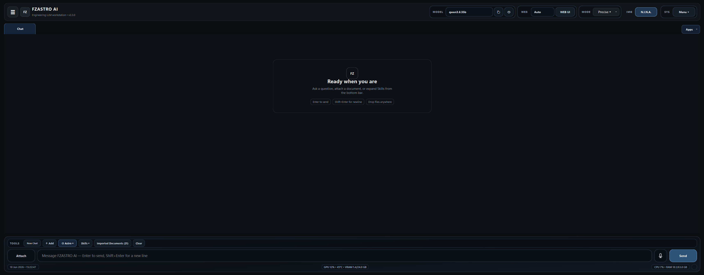
      <br><sub>Main chat workspace with compact tabs, tool shortcuts, telemetry, and Apps launcher.</sub>
    </td>
    <td width="50%">
      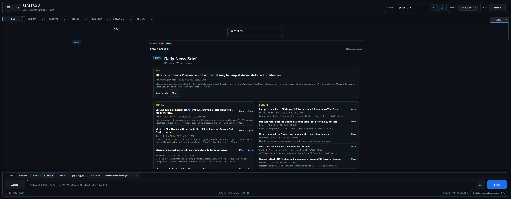
      <br><sub>Daily News Brief with source counts, categories, summaries, and open links.</sub>
    </td>
  </tr>
  <tr>
    <td width="50%">
      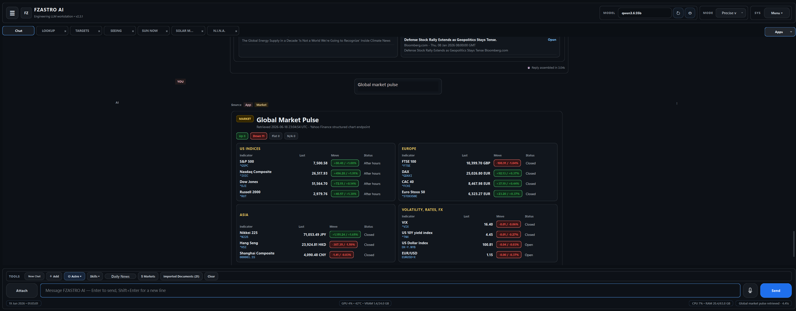
      <br><sub>Global Market Pulse with indices, regions, commodities, FX, status chips, and delayed-data notes.</sub>
    </td>
    <td width="50%">
      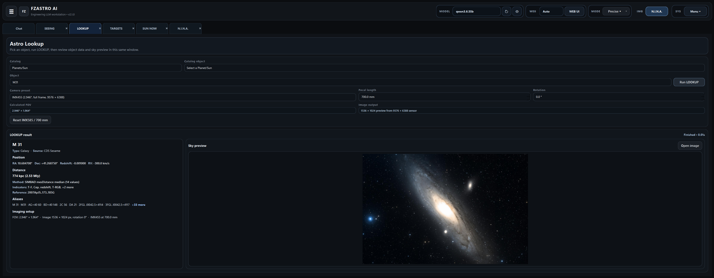
      <br><sub>LOOKUP tab with M31 distance details, camera framing, and sky preview.</sub>
    </td>
  </tr>
  <tr>
    <td width="50%">
      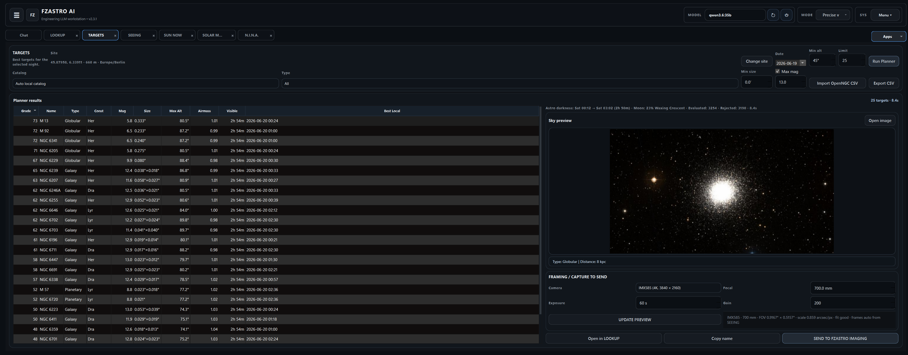
      <br><sub>TARGETS planner with ranked objects, sky preview, and capture handoff controls.</sub>
    </td>
    <td width="50%">
      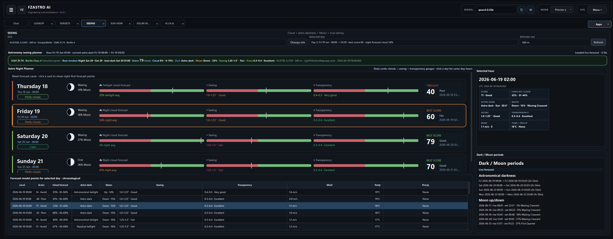
      <br><sub>SEEING Astro Night Planner with hourly cloud, Moon, seeing, transparency, and dark-period context.</sub>
    </td>
  </tr>
  <tr>
    <td width="50%">
      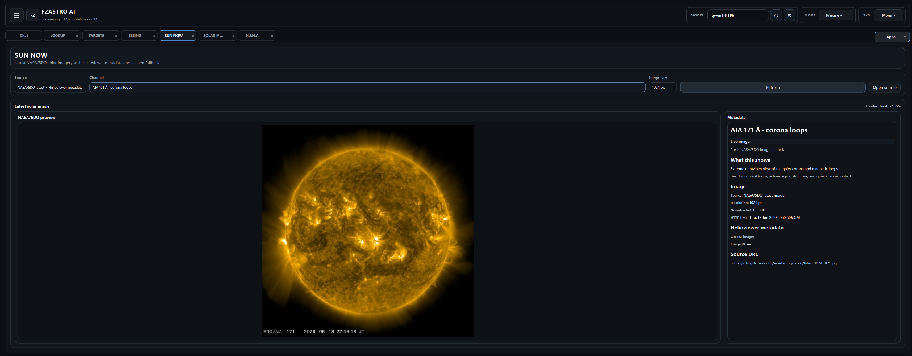
      <br><sub>SUN NOW tab with NASA/SDO solar imagery and metadata.</sub>
    </td>
    <td width="50%">
      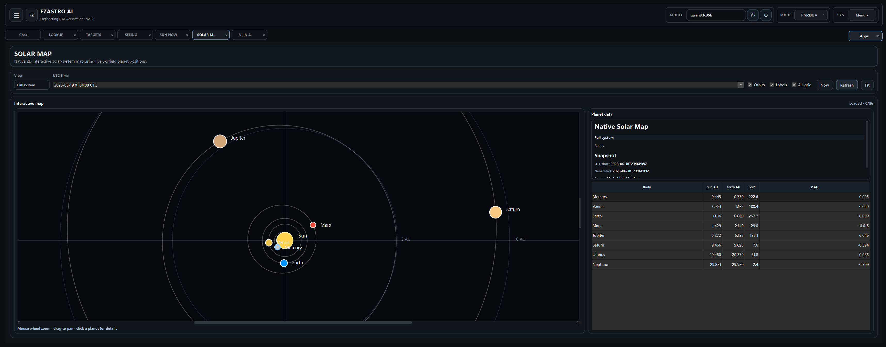
      <br><sub>SOLAR MAP with native 2D planet positions, orbits, labels, and AU grid.</sub>
    </td>
  </tr>
  <tr>
    <td width="50%">
      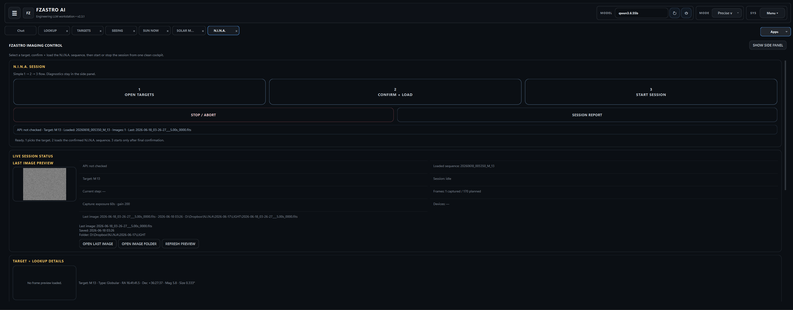
      <br><sub>FZAstro Imaging Control for review-first N.I.N.A. session handoff.</sub>
    </td>
    <td width="50%">
      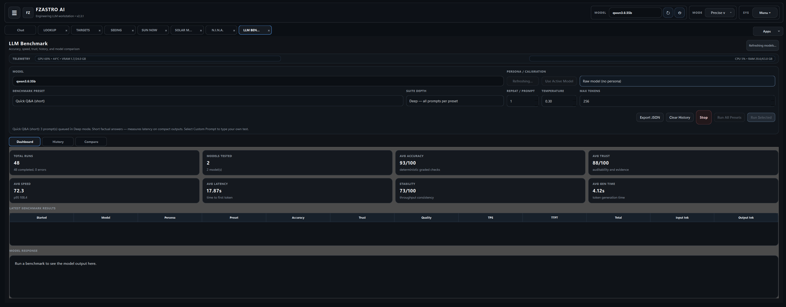
      <br><sub>LLM Benchmark dashboard with telemetry, presets, model/persona selection, and score history.</sub>
    </td>
  </tr>
  <tr>
    <td colspan="2">
      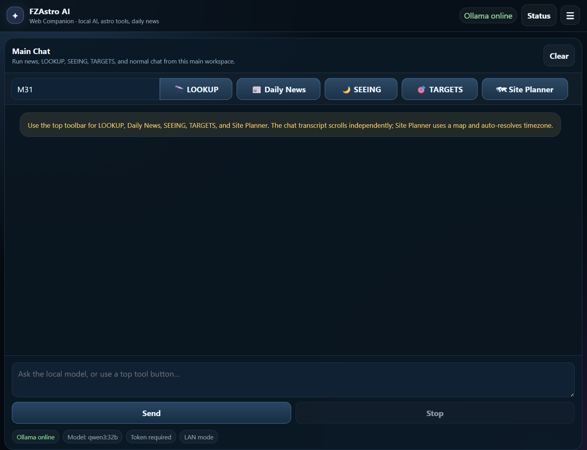
      <br><sub>Web Companion for LAN/mobile workflows with LOOKUP, Daily News, SEEING, TARGETS, Site Planner, and local model chat.</sub>
    </td>
  </tr>
</table>

## Major areas

- **Main workspace** - tabbed Chat, LOOKUP, SEEING, SUN NOW, N.I.N.A., TARGETS, Help/About, and system panels.
- **Astro Tools Suite** - SITE, IMAGING, LOOKUP, SUN NOW, SEEING, TARGETS, and SOLAR MAP.
- **FZASTRO IMAGING / N.I.N.A. bridge** - review-first Advanced Sequencer export, N.I.N.A. API handoff, ARM + START VIA API control, and session reports.
- **OpenClaude workspace** - embedded Windows ConPTY/pywinpty terminal with xterm.js frontend, compact command menus, Prompt tab, Session status, workspace isolation, and safe shutdown.
- **LLM Benchmark Dashboard** - available as **LLM BENCH** from Apps/workspace actions, with telemetry, history, compare views, persona/calibration checks, and raw-model scoring.
- **Document knowledge** - local document import/search with SQLite-backed storage.
- **Web Companion** - local browser/LAN companion for mobile and iPad workflows.

## External prerequisites

FZAstro ships support for local model and coding-agent workflows, but it does **not** bundle external runtimes or model blobs.

Optional workstation tools:

- **Ollama** - required only for Ollama local models and the `http://localhost:11434` service.
- **Node.js/npm + OpenClaude CLI** - required only for the embedded OpenClaude coding workspace.
- **Git + ripgrep** - recommended for OpenClaude workspace inspection and project search.

The app should run without those tools. Missing tools are reported in Session/status panels rather than crashing. If you already installed Ollama and OpenClaude, the packaged FZAstro EXE is enough to host the UI, prepare the embedded terminal backend/frontend, and connect to those external services.

Install optional OpenClaude tooling once on a Windows developer workstation:

```powershell
winget install -e --id OpenJS.NodeJS.LTS
winget install -e --id Git.Git
winget install -e --id BurntSushi.ripgrep.MSVC
npm install -g @gitlawb/openclaude@latest
```

## OpenClaude runtime model

OpenClaude uses the model/provider selected by FZAstro and launches with a controlled environment:

```text
CLAUDE_CODE_USE_OPENAI=1
CLAUDE_CODE_USE_POWERSHELL_TOOL=1
CLAUDE_CODE_MAX_OUTPUT_TOKENS=<saved CTX/output cap>
OPENAI_BASE_URL=<selected endpoint>
OPENAI_MODEL=<selected model>
OPENAI_API_KEY=<stored/local key>
```

Workspace isolation is enforced with selected-root and Git-boundary variables:

```text
FZASTRO_PROJECT_ROOT=<selected workspace>
OPENCLAUDE_WORKSPACE_ROOT=<selected workspace>
FZASTRO_WORKSPACE_BOUNDARY=<selected workspace>
GIT_CEILING_DIRECTORIES=<workspace parent>
GIT_TERMINAL_PROMPT=0
GIT_CONFIG_NOSYSTEM=1
```

The **Set Ctx / Output Cap** action changes the saved `CLAUDE_CODE_MAX_OUTPUT_TOKENS` value. Running OpenClaude sessions must be restarted to use a changed cap.

## OpenClaude UI

- **CLAUDE** on the main chat toolbar opens the OpenClaude workspace.
- **Session** is status/setup only: workspace, provider/environment, prerequisites, Git state, AGENTS.md, and terminal readiness.
- **Claude Terminal** hosts the live OpenClaude TUI.
- **Prompt** is a separate PowerShell tab at the same workspace path.
- Compact menus reduce clipping: **Session**, **Claude**, **Input**, and **View**.
- Claude command actions such as `/help`, `/ctx`, `/clear`, `/config`, and `/buddy` auto-submit with Enter.
- Closing FZAstro while OpenClaude is active stops embedded terminals before PyInstaller temp cleanup, reducing `_MEI` shutdown warnings.

## Astro Tools Suite

The Astro Tools Suite includes **SITE, IMAGING, LOOKUP, SUN NOW, SEEING, TARGETS, and SOLAR MAP**. SEEING and TARGETS use structured backend data for cloud-aware planning, night scoring, Bortle context, and target selection rather than scraping rendered UI text.

Bortle-aware visual hints are preserved: **8–9 white/urban**, **6–7 yellow**, **4–5 green**, **2–3 blue**, and **1 violet**. The night planner keeps cloud-aware score caps, moon/darkness context, and urban/white-zone helper text.

Astropy/IERS runtime handling disables unsafe live IERS downloads in the app path to avoid malformed table crashes, while provider timeouts are handled safely and logged instead of breaking astronomy workflows.

## FZASTRO IMAGING / N.I.N.A. workflow

FZASTRO IMAGING CONTROL is a review-first operations cockpit:

1. **OPEN TARGETS** - choose a target from structured TARGETS/SEEING context.
2. **CONFIRM + LOAD INTO N.I.N.A.** - generate the confirmed `.nina-sequence.json`, copy a plain `.json` into the configured N.I.N.A. sequence folder, verify `/sequence/list-available`, load with `GET /sequence/load?sequenceName=...`, and verify `/sequence/state`.
3. **EQUIPMENT PREP / POWER ON** - use basic generated prep steps or load a user-provided `FZAstro_EquipmentPrepSample.json` for N.I.N.A. review only.
4. **ARM + START VIA API** - after explicit confirmation, start the loaded sequence using `GET /sequence/start`.
5. **SESSION REPORT** - write Markdown/JSON reports and show target, conditions, capture, site, API, last-image, and safety highlights in the UI.

The workflow never starts automatically after load. START remains a separate user-confirmed hardware action.

## LLM Benchmark Dashboard

The **LLM Benchmark Dashboard** remains available as **LLM BENCH** from Apps/workspace actions. It includes telemetry, history, comparison views, persona/calibration checks, quality scoring, **Run All Presets**, **Delete Selected**, Composite scoring, and raw-model testing with **Raw model (no persona)**.

## Distance ladder calculations

FZAstro AI includes **Distance ladder calculations** for astronomy object context. The distance-ladder path can use parallax, Gaia, NED-D, Hubble, and `hubble(z)` fallback logic where available. Use `FZASTRO_USE_DISTANCE_LADDER` to enable or control this feature in supported workflows.

## Build and release workflow

Use Python 3.11 for the packaged app build and validation workflow. The scripts enforce Python 3.11 even when newer interpreters such as **Python 3.14** are installed.

```powershell
py -3.11 -m venv .venv
. .\scripts\activate_venv.ps1
.\DEPLOY.bat
```

`DEPLOY.bat` is the root-folder deploy button. It runs `scripts/deploy.ps1 -SetupOpenClaudeCompanion -InstallOpenClaudeIfMissing -RunValidation -GitRelease`, so a successful deploy can prepare the OpenClaude companion when Node/npm are available and create the local Git release commit and annotated tag from `VERSION.txt`. Add `-GitPush` when you want the branch and tag pushed.

```powershell
.\DEPLOY.bat -GitPush
```

PowerShell equivalent:

```powershell
powershell -ExecutionPolicy Bypass -File .\scripts\deploy.ps1 -SetupOpenClaudeCompanion -InstallOpenClaudeIfMissing -RunValidation -GitRelease
powershell -ExecutionPolicy Bypass -File .\scripts\deploy.ps1 -SetupOpenClaudeCompanion -InstallOpenClaudeIfMissing -RunValidation -GitRelease -GitPush
```

`build_exe.ps1` handles Python imports and packaged resources for a clean build environment. It prepares the embedded OpenClaude terminal backend/frontend, installs/checks `pywinpty`, packages `winpty`, formats with Black, runs automated tests, and writes logs under `..\FZAstroAI_BUILD\logs`.

External tools remain external prerequisites. Build/deploy should detect Ollama, Node/npm, Git, ripgrep, and OpenClaude and report missing items as warnings/status unless a command explicitly requires them. Release validation skips `ollama list` by default so deploy checks do not depend on a running Ollama server. Use `scripts/validate_release.ps1 -DeepRuntimeChecks` only when you want the optional Ollama model list check.

Important build variables:

- `FZASTRO_PROJECT_ROOT`
- `FZASTRO_BUILD_ROOT`
- `FZASTRO_PYTHON`

## Clean source tree

Keep the project root lean:

- Root: `main.py`, `DEPLOY.bat`, `VERSION.txt`, README, requirements, pytest/Black config, icon/spec files.
- Source: `fzastro_ai/`
- Docs: `docs/`
- Scripts: `scripts/`
- Tests: `tests/`

Do not commit generated caches, local virtual environments, external N.I.N.A. worktrees, bundled runtime binaries, build output, installer leftovers, or root `.ps1` scratch scripts.

## Runtime storage

Runtime data is stored under `%APPDATA%\FZAstroAI` by default. Important files include:

- `history.json`
- `memory.json`
- `calibration_profiles.json`
- `document_knowledge.sqlite3`
- `daily_news_cache.json`
- `llm_benchmark_history.json`
- `nina_integration.json`
- `openclaude_settings.json`
- `logs/fzastroai.log`

Set `FZASTRO_APP_DIR` to override the runtime data folder for testing or portable runs.

## Validation

Recommended local validation before release:

```powershell
.\.venv\Scripts\python.exe -m compileall -q main.py fzastro_ai tests
.\.venv\Scripts\python.exe -m pytest -q
.\scripts\build_exe.ps1
```

For focused OpenClaude checks:

```powershell
.\.venv\Scripts\python.exe -m pytest -q tests/test_openclaude_bridge.py tests/test_openclaude_embedded_terminal.py tests/test_openclaude_ui_source_contract.py tests/test_openclaude_settings.py
```
